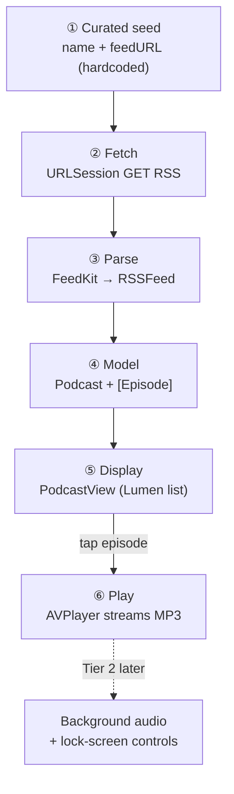
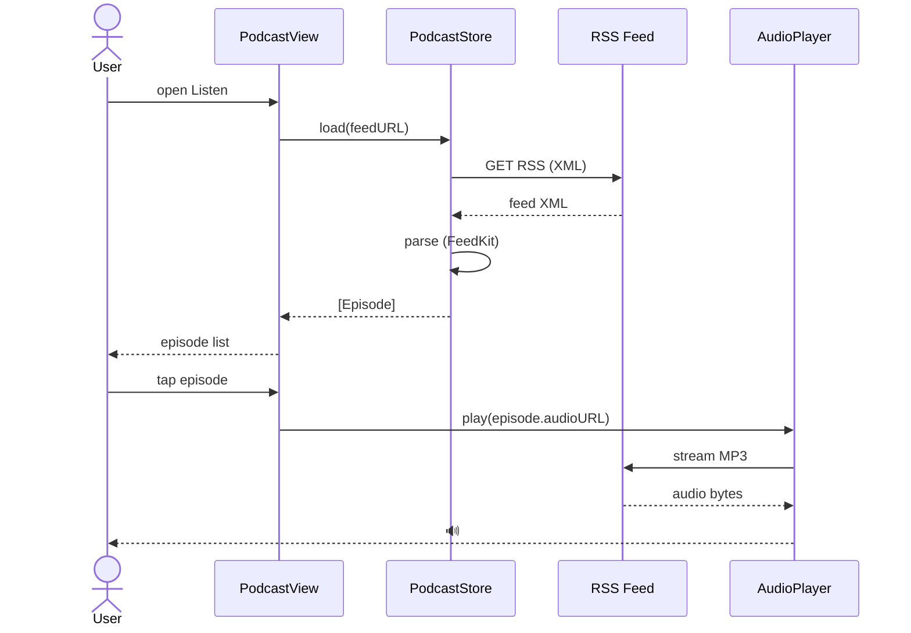

# Podcast Flow — Single-Podcast Simulation

A "full pass" for displaying **one** podcast end-to-end: from a hardcoded
curated entry, through the network + parse, to an on-screen episode list and
streamed playback. Scoped deliberately small to prove the flow before building
the real multi-podcast feature.

**Concrete example used throughout:** a Fr. Mike Schmitz show (priest-hosted,
orthodox, #1 Catholic podcast — a safe, real stand-in).

---

## What's real vs. simulated in this pass

| Piece | This pass | Deferred (later tiers) |
|---|---|---|
| Podcast source | **1 hardcoded feed URL** | iTunes Lookup API, multiple curated feeds, search |
| Fetch | **real** live RSS over HTTPS | caching, refresh policy |
| Parse | **real** (FeedKit) | malformed-feed hardening |
| Display | **real** Lumen episode list | artwork caching, pull-to-refresh |
| Playback | **real** AVPlayer streaming (foreground) | background audio, lock-screen controls, downloads, queue, speed |

---

## The pipeline (data → screen → sound)

```
┌──────────────────────────────────────────────────────────────────┐
│  ① CURATED SEED  (hardcoded for the 1-podcast simulation)         │
│                                                                    │
│     PodcastSeed {                                                  │
│       name:    "Fr. Mike Schmitz"                                  │
│       feedURL: <RSS url — see "Getting the feedURL" below>         │
│     }                                                              │
└───────────────────────────┬──────────────────────────────────────┘
                            │ open the "Listen" entry
                            ▼
┌──────────────────────────────────────────────────────────────────┐
│  ② FETCH         PodcastStore.load(feedURL)                        │
│                                                                    │
│     URLSession ──GET──▶ RSS feed  (XML, HTTPS)                     │
└───────────────────────────┬──────────────────────────────────────┘
                            │ raw XML data
                            ▼
┌──────────────────────────────────────────────────────────────────┐
│  ③ PARSE         FeedKit  →  RSSFeed                               │
│                                                                    │
│     channel  → { title, author, imageURL }                        │
│     items[]  → [{ title, pubDate,                                  │
│                   enclosure.url  ← the MP3,                        │
│                   itunes.duration, summary }]                      │
└───────────────────────────┬──────────────────────────────────────┘
                            │ decoded
                            ▼
┌──────────────────────────────────────────────────────────────────┐
│  ④ MODEL         @Observable PodcastStore                          │
│                                                                    │
│     Podcast { title, host, artworkURL, episodes: [Episode] }      │
│     Episode { title, date, audioURL, duration, summary }          │
└───────────────────────────┬──────────────────────────────────────┘
                            │ SwiftUI observes
                            ▼
┌──────────────────────────────────────────────────────────────────┐
│  ⑤ DISPLAY       PodcastView  (Lumen styled)                       │
│                                                                    │
│     ┌────────────────────────────────────────────┐               │
│     │  [artwork]   Fr. Mike Schmitz               │               │
│     │              Ascension                       │               │
│     ├────────────────────────────────────────────┤               │
│     │  ▸  Episode title one        24 min · Jun 6 │ ◀─ tap        │
│     │  ▸  Episode title two        22 min · Jun 5 │               │
│     │  ▸  Episode title three      19 min · Jun 4 │               │
│     │     …                                        │               │
│     └────────────────────────────────────────────┘               │
└───────────────────────────┬──────────────────────────────────────┘
                            │ tap → episode.audioURL
                            ▼
┌──────────────────────────────────────────────────────────────────┐
│  ⑥ PLAY          AudioPlayer  (AVPlayer)                           │
│                                                                    │
│     AVPlayer(url: audioURL) ──stream──▶ 🔊                         │
│     play / pause / scrub                                           │
│     ··· (Tier 2 later) AVAudioSession.playback                    │
│              + MPNowPlayingInfoCenter + MPRemoteCommandCenter ···  │
└──────────────────────────────────────────────────────────────────┘
```

---

## The tap, as a sequence

```
User        PodcastView      PodcastStore      Network/RSS      AudioPlayer (AVPlayer)
 │               │                │                 │                    │
 │ open Listen   │                │                 │                    │
 ├──────────────▶│  .task         │                 │                    │
 │               ├───load(feed)──▶│                 │                    │
 │               │                ├─────GET RSS─────▶│                    │
 │               │                │◀────XML──────────┤                    │
 │               │                │  parse(FeedKit)  │                    │
 │               │◀──[Episode]────┤                 │                    │
 │   see list    │                │                 │                    │
 │◀──────────────┤                │                 │                    │
 │               │                │                 │                    │
 │ tap episode   │                │                 │                    │
 ├──────────────▶│────────────── play(episode.audioURL) ───────────────▶│
 │               │                │                 │   AVPlayer(url:)   │
 │               │                │                 │◀──stream MP3───────┤
 │  🔊 audio     │                │                 │                    │
 │◀───────────────────────────────────────────────────────────────────┤
```

---

## How it maps to new files (Lumen / SwiftUI / SwiftData stack)

| Stage | New file | Responsibility |
|---|---|---|
| ① seed | `Features/Listen/PodcastSeed.swift` | the 1 hardcoded `{name, feedURL}` |
| ②③④ | `Services/Podcasts/PodcastStore.swift` | `@Observable`; `load()` = URLSession + FeedKit parse → `Podcast`/`Episode` |
| ②③④ | `Services/Podcasts/PodcastModels.swift` | `Podcast`, `Episode` structs |
| ⑤ | `Features/Listen/PodcastView.swift` | Lumen header + episode list; `.task { await store.load() }` |
| ⑥ | `Services/Podcasts/AudioPlayer.swift` | `@Observable` wrapper around `AVPlayer`; play/pause/seek |
| ⑥ | `Features/Listen/PlayerBar.swift` | mini play/pause + scrubber UI |

**New dependency:** FeedKit (SPM) for RSS parsing. **No background-audio entry
yet** — this pass is foreground-only on purpose.

---

## Getting the feedURL (one-time, not in-app for the sim)

Apple doesn't hand you RSS directly, but its free Lookup API does. Resolve the
podcast's Apple ID → its `feedUrl`, then hardcode that into the seed:

```bash
curl -s "https://itunes.apple.com/lookup?id=<applePodcastId>&entity=podcast" \
  | python3 -c "import sys,json; print(json.load(sys.stdin)['results'][0]['feedUrl'])"
```

For the real feature you'd call this in-app to support many shows; for this
single-podcast pass we skip it and paste the one `feedUrl` straight into
`PodcastSeed`.

---

## Mermaid versions (render in GitHub / VS Code Mermaid preview)

### Flow



### Sequence


